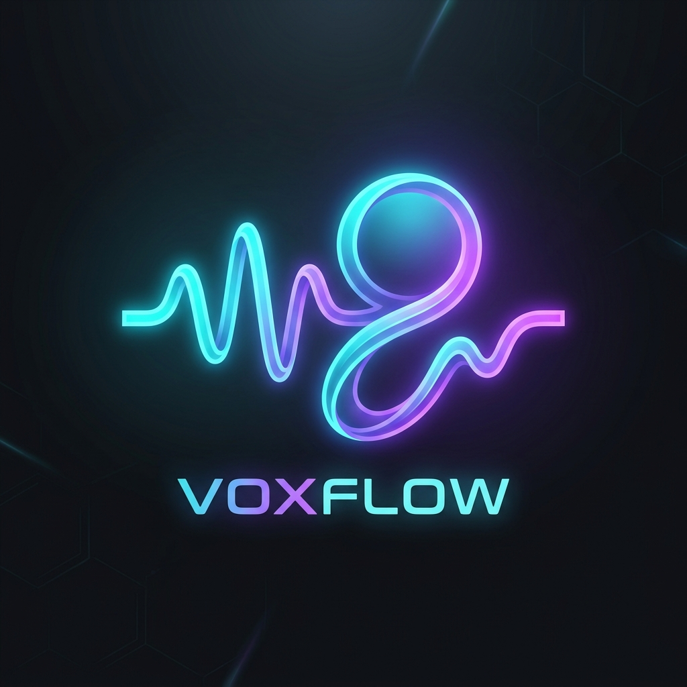

<p align="center">
  
</p>

<h1 align="center">VoxFlow — Cross-Platform Voice Task AI</h1>

<p align="center">
  <em>An autonomous, low-latency, cross-platform voice assistant and automation agent for <strong>macOS</strong> and <strong>Windows</strong>.</em>
</p>

<p align="center">
  <a href="https://github.com/imharsha33/Voice-Text--Task-Agent/actions"></a>
  <a href="https://github.com/imharsha33/Voice-Text--Task-Agent/blob/main/LICENSE"></a>
  <a href="https://python.org"></a>
  <a href="https://github.com/imharsha33/Voice-Text--Task-Agent"></a>
</p>

---

## 🌟 Overview

**VoxFlow** is a full-featured, voice-driven autonomous desktop assistant. On startup, VoxFlow greets you warmly:

> 🎙️ *"Hello there! How can I help you today?"*

By listening continuously for the wake word **"Hey VoxFlow"** or receiving instructions through its live Cyberpunk Glassmorphism web dashboard, VoxFlow reasons through multi-step tasks, controls desktop applications, manages files, executes safe terminal commands, automates browser sessions, and speaks responses in real time.

---

## ✨ Key Features

- 🎙️ **Single-Pass Low-Latency Voice Pipeline**: Voice Activity Detection (VAD) with pre-roll circular history buffer, Groq Whisper speech-to-text, and concurrent sentence-queue TTS for instant voice replies without awkward delays or overlapping voices.
- 🖥️ **Full Cross-Platform Support (PAL)**: Built on a unified **Platform Abstraction Layer** with separate native controller implementations for **macOS** (AppleScript, system tools) and **Windows** (PowerShell, Win32, WMI), with Linux readiness.
- 🌐 **Interactive Browser Automation**: Playwright-powered background and visual browser search, automated YouTube video playback, and web page reading.
- 🛡️ **Built-in Safety & Confirmation Guardrails**: Intercepts destructive commands (`rm -rf`, `format`, `del /s /q`, `mkfs`, system shutdown, file deletion) and enforces explicit user confirmation.
- 📊 **Task Telemetry & Token Tracking**: Real-time token tracking, exact task execution latencies, and accurate Groq API cost estimations.
- 💻 **Cyberpunk Glassmorphism Web Dashboard**: Responsive dark-mode interface with live streaming tokens, waveform audio visualization, and quick-action cards at `http://localhost:8765`.

---

## 🏗️ Architecture

```
                               ┌─────────────────────────────────────┐
                               │             Agent Core              │
                               │  (brain.py, state.py, prompts.py)   │
                               └──────────────────┬──────────────────┘
                                                  │
           ┌──────────────────────┬───────────────┴───────────────┬──────────────────────┐
           ▼                      ▼                               ▼                      ▼
 ┌──────────────────┐   ┌──────────────────┐            ┌──────────────────┐   ┌──────────────────┐
 │  Voice Subsystem │   │   LLM Provider   │            │  Tool Dispatcher │   │  Observability   │
 │  STT & TTS PAL   │   │  (Groq Cascade & │            │ (Shell, Browser, │   │ (Task Telemetry, │
 │  (Queue Player)  │   │ VOXFLOW-LM ready)│            │ Filesystem, App) │   │ Tokens, Costs)   │
 └──────────────────┘   └──────────────────┘            └────────┬─────────┘   └──────────────────┘
                                                                 │
                                               ┌─────────────────┴─────────────────┐
                                               ▼                                   ▼
                                      ┌──────────────────┐                ┌──────────────────┐
                                      │  macOS Platform  │                │ Windows Platform │
                                      │  (AppleScript /  │                │  (PowerShell /   │
                                      │   OS Commands)   │                │   Win32 / Cmd)   │
                                      └──────────────────┘                └──────────────────┘
```

---

## 🧰 Available Tools & Capabilities

| Category | Available Operations | Examples |
|:---|:---|:---|
| 🖥️ **Applications** | `open_app`, `close_app`, `switch_to_app`, `get_running_apps`, `get_frontmost_app` | *"Open Chrome"*, *"Switch to VS Code"*, *"Open Calculator"* |
| 📁 **Filesystem** | `get_standard_directory` (Desktop, Documents, Downloads, Pictures, Videos, Music, Home), `read_file`, `write_file`, `list_files`, `delete_file` | *"List files on my Desktop"*, *"Create a todo list file in Documents"* |
| 🌐 **Browser** | `search_youtube`, `search_google`, `open_url`, `get_page_content`, `web_quick_search` | *"Play Interstellar soundtrack on YouTube"*, *"Search Google for latest tech news"* |
| ⌨️ **Input / GUI** | `type_text`, `press_key`, `click_at`, `take_screenshot`, `copy_to_clipboard`, `get_clipboard` | *"Take a screenshot"*, *"Type Hello World"* |
| 🔊 **Audio & Power**| `set_volume`, `get_volume`, `mute_audio`, `unmute_audio`, `set_brightness`, `lock_screen`, `sleep_system` | *"Set volume to 50%"*, *"Mute audio"*, *"Lock my screen"* |
| 🔒 **System Control**| `get_system_info`, `get_running_processes`, `open_settings`, `empty_trash`, `shutdown_system`, `restart_system` | *"Show system info"*, *"Open system settings"*, *"Empty trash"* |

---

## 📥 Installation

### Prerequisites
- Python **3.10+**
- A free [Groq API Key](https://console.groq.com)

### 1. Clone Repository
```bash
git clone https://github.com/imharsha33/Voice-Text--Task-Agent.git
cd Voice-Text--Task-Agent
```

### 2. Set Up Virtual Environment

**macOS:**
```bash
python3 -m venv venv
source venv/bin/activate
```

**Windows:**
```powershell
python -m venv venv
.\venv\Scripts\Activate.ps1
```

### 3. Install Dependencies
```bash
pip install -r requirements.txt
python -m playwright install chromium
```

### 4. Configure Environment
```bash
cp .env.example .env
```
Edit `.env` and add your Groq API key:
```env
GROQ_API_KEY=gsk_your_groq_api_key_here
GROQ_MODEL=llama-3.3-70b-versatile
```

---

## ⚡ Quick Start & Running

### 1. Run Preflight Diagnostics
Verify microphone input, API connectivity, and package installation:
```bash
python setup_check.py
```

### 2. Run All Unit & PAL Tests
```bash
python -m unittest discover -s tests -p "test_*.py"
```

### 3. Start VoxFlow Agent
```bash
python main.py
```
This starts:
1. 🎙️ **Voice Listener**: Listens for the wake word **"Hey VoxFlow"**.
2. 🌐 **Web Dashboard**: Interactive dashboard running at **`http://localhost:8765`**.
3. 🔊 **Voice Greeting**: Speaks *"Hello there! How can I help you today?"*.

---

## 🔒 Security & Confirmation Model

VoxFlow automates real computer tasks with strict built-in safety controls:
- **Destructive Command Blocking**: High-risk commands (`rm -rf`, `format`, `del /s /q`, `mkfs`, fork bombs, system shutdown, and permanent file deletion) are automatically intercepted and blocked.
- **Explicit Confirmation**: High-risk actions require explicit `confirm=True` approval from the user.
- **Dynamic Path Containment**: Uses standard `pathlib.Path` to prevent unauthorized file system traversal.

---

## 🗺️ Roadmap

- [x] Full macOS Support (AppleScript, system tools, notifications)
- [x] Full Windows Support (PowerShell, Win32, system utilities)
- [x] Cross-Platform Sentence-Queue TTS with Clean Single Greeting
- [x] Structured Task Telemetry & Real Token Cost Tracking
- [x] Cyberpunk Glassmorphism Web Dashboard with Custom VoxFlow Brand Logo
- [ ] Native Linux Platform Implementation
- [ ] Integration of custom **VOXFLOW-LM** foundational reasoning model upon release
- [ ] Offline local STT / Whisper.cpp fallback

---

## 📄 License

This project is licensed under the [MIT License](LICENSE).